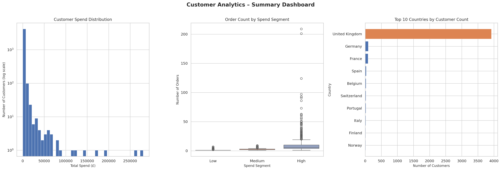
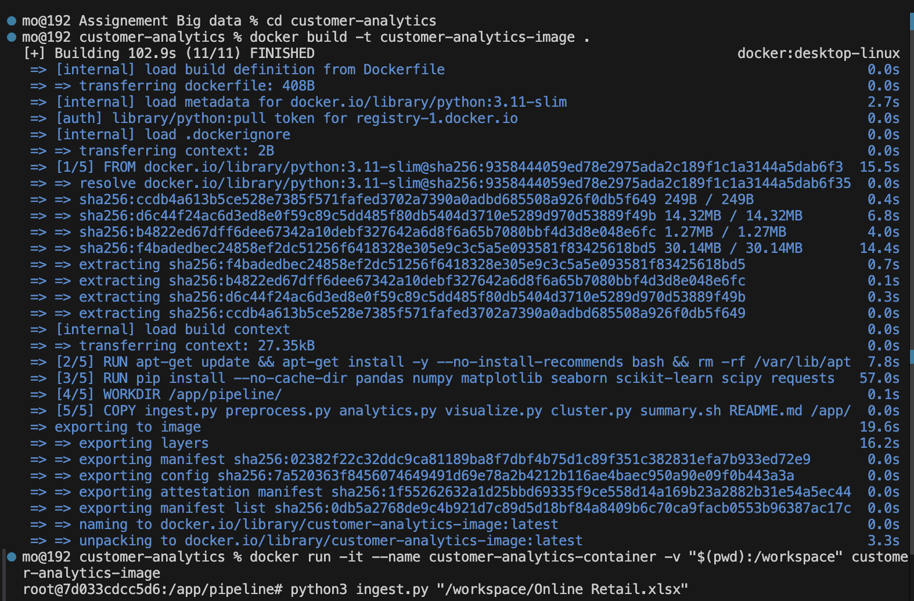
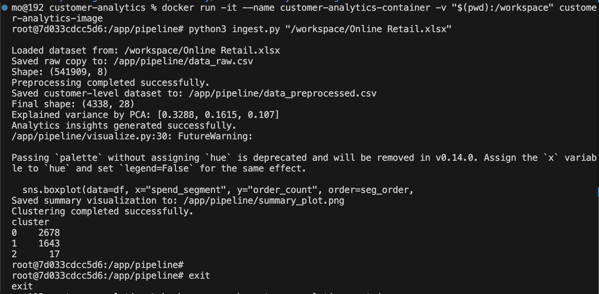

# Customer Analytics Pipeline - CSCI461 Assignment 1

## Team Members

| Name | ID |
|---|---|
| Tawfik Hisham Tawfik | 221001918 |
| Ahmed Abdelsameea Mahmoud | 202001427 |
| Nada Gamal Zaki | 221000829 |

---

## Dataset

**Name:** Online Retail Dataset  
**Source:** UCI Machine Learning Repository  
**File:** `Online Retail.xlsx` (placed next to the scripts)  
**Format:** Raw Excel file — not pre-cleaned

**Columns in the raw dataset:**

| Column | Description |
|---|---|
| InvoiceNo | Unique transaction ID. IDs starting with "C" are cancellations |
| StockCode | Product code |
| Description | Product name (has missing values) |
| Quantity | Number of items bought (some rows have negative values) |
| InvoiceDate | Date and time of the purchase |
| UnitPrice | Price per single item (some rows have zero price) |
| CustomerID | Unique customer identifier (many rows have missing IDs) |
| Country | Country of the customer |

---

## Folder Structure

```
customer-analytics/
├── Dockerfile
├── ingest.py
├── preprocess.py
├── analytics.py
├── visualize.py
├── cluster.py
├── summary.sh
├── README.md
└── results/
    ├── data_raw.csv
    ├── data_preprocessed.csv
    ├── clustered_customers.csv
    ├── insight1.txt
    ├── insight2.txt
    ├── insight3.txt
    ├── clusters.txt
    └── summary_plot.png
```

---

## Execution Flow

Each script automatically calls the next one when it finishes:

```
ingest.py → preprocess.py → analytics.py → visualize.py → cluster.py
```

You only need to run `ingest.py` once. The rest of the pipeline runs automatically.

---

## What Each File Does (Detailed)

### Dockerfile

Sets up a reproducible Python 3.11 environment inside Docker.

| Instruction | What it does |
|---|---|
| `FROM python:3.11-slim` | Uses a minimal Python image as the base |
| `RUN pip install ...` | Installs all required libraries |
| `WORKDIR /app/pipeline/` | Sets the folder where scripts will run inside the container |
| `COPY ... /app/pipeline/` | Copies all project scripts into the container |
| `CMD ["/bin/bash"]` | Opens an interactive terminal when the container starts |

> **Why not copy the dataset into the image?**  
> The `Online Retail.xlsx` file is 23 MB. Baking it into the Docker image makes the image large and hard to share. Instead, we mount it from the host machine at runtime using `-v` (volume mount). This keeps the image small and reusable.

---

### ingest.py

**Purpose:** Loads the raw dataset and saves a clean copy as `data_raw.csv`.

**How it works step by step:**
1. Reads the file path from the command line (`sys.argv[1]`) — this is how you pass input to a Python script from the terminal without modifying the code.
2. Detects the file format (CSV, Excel, JSON, TSV, ZIP) automatically.
3. Loads the file into memory as a table (a Pandas DataFrame).
4. Saves an unmodified copy as `data_raw.csv` so we always have the original.
5. Automatically calls `preprocess.py` with the path to `data_raw.csv`.

> **What is `sys.argv[1]`?**  
> When you type `python ingest.py "/workspace/Online Retail.xlsx"` in the terminal, Python sees a list of words: `["ingest.py", "/workspace/Online Retail.xlsx"]`. `sys.argv[1]` means "take the second word in that list" — which is the file path you typed. It's just Python's way of accepting input from the terminal.

---

### preprocess.py

**Purpose:** Cleans and transforms the data, then saves `data_preprocessed.csv`.

The dataset starts with ~500,000 transaction rows. After preprocessing, it becomes one row per customer (~4,338 customers) with all the features needed for analysis and clustering.

#### Stage 1 — Data Cleaning (5 tasks)

| Task | What it does | Why |
|---|---|---|
| Remove duplicates | Drops identical rows | Duplicate rows would count the same purchase twice |
| Fill missing descriptions | Replaces blank product names with "Unknown Product" | Avoids errors when reading the column later |
| Drop missing CustomerIDs | Removes rows with no customer | We can't group by customer if the ID is missing |
| Parse invoice dates | Converts the date column to a proper date format | Required for calculating how recently a customer bought |
| Remove cancellations & invalid rows | Drops rows where InvoiceNo starts with "C", Quantity ≤ 0, or UnitPrice ≤ 0 | Cancelled orders and returns should not count as sales |

#### Stage 2 — Feature Transformation (3 tasks)

| Task | What it does | Why |
|---|---|---|
| Convert CustomerID to integer | Changes from float (e.g. 17850.0) to int (17850) | Cleaner for grouping and display |
| Create LineTotal | Multiplies Quantity × UnitPrice per row | Gives the actual money value of each transaction row |
| Extract time features | Adds InvoiceMonth, InvoiceHour, WeekendFlag columns | Captures customer shopping behavior patterns |
| Aggregate to customer level | Groups all transactions by customer, computing totals, averages, and counts | Converts 500K rows → one meaningful row per customer |

#### Stage 3 — Dimensionality Reduction (3 tasks)

| Task | What it does | Why |
|---|---|---|
| Customer-level aggregation | Collapses all orders for one customer into a single row | Reduces from 500K rows to ~4K (one per customer) |
| Lifecycle features | Computes `recency_days` (how recently they bought) and `customer_lifespan_days` | Captures loyalty and engagement in numbers |
| StandardScaler + PCA | Scales all 10 numeric features to the same range, then compresses them into 3 PCA dimensions | Allows fair comparison between features and enables clustering |

> **What is PCA?**  
> PCA (Principal Component Analysis) takes many columns (we have 10 numeric features) and finds a smaller number of "summary columns" that still capture most of the information. Think of it as compressing a large photo — you lose some detail, but the overall picture remains clear. `pca_1`, `pca_2`, `pca_3` are those 3 summary columns, each one a mathematical blend of all 10 original features.

#### Stage 4 — Discretization (3 tasks)

| Task | What it does | Why |
|---|---|---|
| Spending bands | Labels each customer as Low / Medium / High spender | Turns a raw number into an easy-to-read category |
| Frequency bands | Labels each customer as Rare / Regular / Frequent buyer | Makes purchase frequency interpretable |
| Recency bands | Labels each customer as Fresh / Active / Dormant | Shows how recently they engaged |

---

### analytics.py

**Purpose:** Generates 3 text insights from the preprocessed data.

| Output file | Contents |
|---|---|
| `insight1.txt` | Total customers, average spend, median orders, top-10 revenue share |
| `insight2.txt` | Which country has the most customers and highest revenue |
| `insight3.txt` | How spending and frequency segments behave differently |

---

### visualize.py

**Purpose:** Creates 3 charts saved together as `summary_plot.png`.

| Plot | What it shows | Why this chart type |
|---|---|---|
| Spend Distribution (histogram) | How customer spending is spread — most spend very little, a few spend a lot | Histogram shows the shape of a distribution; log scale is used on the Y-axis because the data is highly skewed |
| Average Spend by Segment (bar chart) | The average £ spent by Low / Medium / High segment | Simple bar chart makes the comparison between groups immediately clear |
| Top 10 Countries (horizontal bar) | Which countries have the most customers; UK is highlighted in orange | Horizontal bars are easier to read when labels are country names |

---

### cluster.py

**Purpose:** Groups customers into 3 clusters using K-Means and saves the result.

**How K-Means works here, step by step:**
1. Takes the 3 PCA columns (`pca_1`, `pca_2`, `pca_3`) as input — these represent each customer as a point in 3D space.
2. K-Means picks 3 random starting points ("centroids") and assigns every customer to their nearest centroid.
3. It then recalculates the center of each group and repeats until the groups stop changing.
4. Each customer is labeled with a cluster number (0, 1, or 2).
5. The count of customers in each cluster is written to `clusters.txt`.
6. The full table with cluster assignments is saved as `clustered_customers.csv`.

> **Why use pca_1/2/3 instead of the original columns?**  
> Using the 3 PCA columns instead of the original 10 columns makes clustering faster, avoids redundancy between correlated features, and produces more stable clusters.

---

### summary.sh

**Purpose:** Copies all pipeline output files from inside the Docker container to the `results/` folder on your Mac/PC, then stops and deletes the container.

**Why do we need this script?**  
Files created inside a Docker container exist only inside that container. They are not automatically visible on your computer. `summary.sh` uses `docker cp` to transfer each output file to the `results/` folder on your host machine.

**Why delete the container afterward?**  
Docker containers are meant to be disposable — you create them, use them, and throw them away. Keeping old containers around wastes disk space. Since all outputs are already copied to `results/`, the container is no longer needed.

---

## Docker Commands

### Step 1 — Build the Docker Image

Run this **once** from inside the `customer-analytics/` folder:

```bash
docker build -t customer-analytics-image .
```

> `-t customer-analytics-image` gives the image a name.  
> `.` means "use the Dockerfile in the current folder."

---

### Step 2 — Run the Container

**On Mac / Linux:**
```bash
docker run -it --name customer-analytics-container \
  -v "$(pwd):/workspace" \
  customer-analytics-image
```

**On Windows PowerShell:**
```powershell
docker run -it --name customer-analytics-container `
  -v "${PWD}:/workspace" `
  customer-analytics-image
```

> `-it` opens an interactive shell.  
> `--name` gives the container a name so `summary.sh` can find it.  
> `-v "$(pwd):/workspace"` mounts your current folder into the container at `/workspace`, so the dataset file is accessible inside.

---

### Step 3 — Run the Pipeline (inside the container)

```bash
python ingest.py "/workspace/Online Retail.xlsx"
```

This single command runs the entire pipeline: ingest → preprocess → analytics → visualize → cluster.

---

### Step 4 — Exit the Container

```bash
exit
```

---

### Step 5 — Copy Results and Remove the Container

Run this **on your host machine** (not inside Docker), from inside `customer-analytics/`:

```bash
bash summary.sh customer-analytics-container
```

This copies all output files to `results/` and removes the container.

---

## Sample Outputs

### insight1.txt
```
Customer base summary
- Total customers after preprocessing: 4338
- Average customer spend: 2048.69
- Median number of orders per customer: 3
- Top 10 customers contribute 12.45% of total spend.
```

### clusters.txt
```
K-Means clustering summary (k=3)
Cluster 0: 2678 customers
Cluster 1: 1643 customers
Cluster 2: 17 customers
```

---

## Screenshots

### Pipeline Output Plot



### Terminal Output





---
